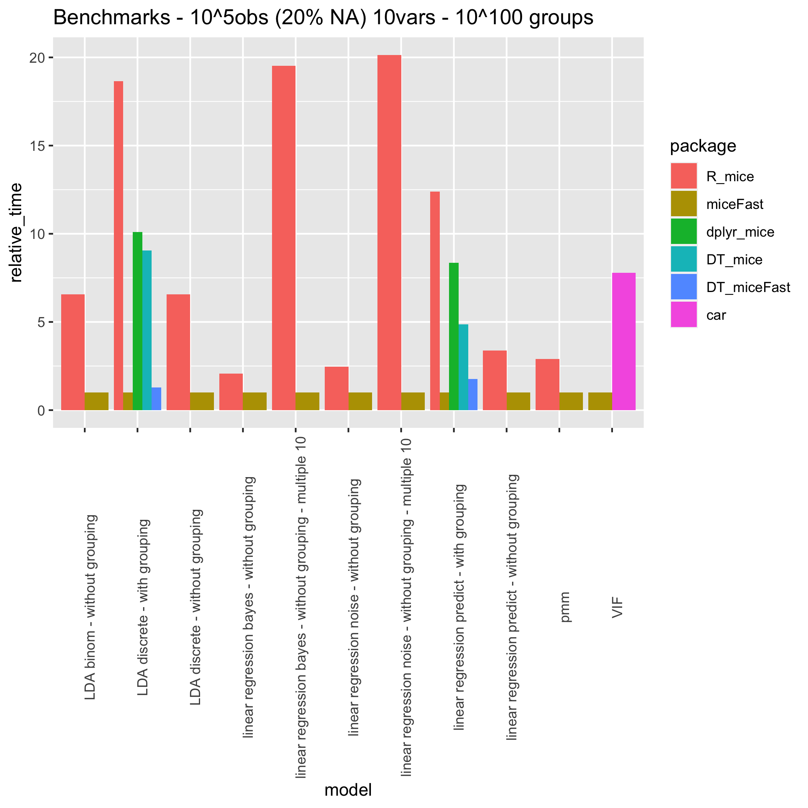

# miceFast <a href='https://github.com/polkas/miceFast'></a>

**Author**: Maciej Nasinski  

[**Check the miceFast website for more details**](https://polkas.github.io/miceFast/index.html)

[](https://github.com/polkas/miceFast/actions)
[](https://cran.r-project.org/package=miceFast)
[](https://app.codecov.io/gh/Polkas/miceFast)
[](https://cran.r-project.org/package=miceFast)

## Overview

**miceFast** provides fast methods for imputing missing data, leveraging an object-oriented programming paradigm and optimized linear algebra routines.  
The package includes convenient helper functions compatible with **data.table**, **dplyr**, and other popular R packages.

Major speed improvements occur when:  
- Using a **grouping variable**, where the data is automatically sorted by group, significantly reducing computation time.
- Performing **multiple imputations**, by evaluating the underlying quantitative model only once for multiple draws.
- Running **Predictive Mean Matching (PMM)**, thanks to presorting and binary search.

For performance details, see `performance_validity.R` in the `extdata` folder.

[It is recommended to read the Advanced Usage Vignette](https://polkas.github.io/miceFast/articles/miceFast-intro.html).

## Installation

You can install **miceFast** from CRAN:
```r
install.packages("miceFast")
```
Or install the development version from GitHub:
```r
# install.packages("devtools")
devtools::install_github("polkas/miceFast")
```

## Quick Example

Below is a short demonstration. See the [vignette](https://polkas.github.io/miceFast/articles/miceFast-intro.html) for advanced usage and best practices.

```r
library(miceFast)

set.seed(1234)
data(air_miss)

# Visualize the NA structure
upset_NA(air_miss, 6)

# Simple and naive fill
imputed_data <- naive_fill_NA(air_miss)

# Compare with other packages:
# Hmisc
library(Hmisc)
data.frame(Map(function(x) Hmisc::impute(x, "random"), air_miss))

# mice
library(mice)
mice::complete(mice::mice(air_miss, printFlag = FALSE))
```

---

## Key Features

- **Object-Oriented Interface** via `miceFast` objects (Rcpp modules).
- **Convenient Helpers**:  
  - `fill_NA()`: Single imputation (`lda`, `lm_pred`, `lm_bayes`, `lm_noise`).  
  - `fill_NA_N()`: Multiple imputations (`pmm`, `lm_bayes`, `lm_noise`).  
  - `VIF()`: Variance Inflation Factor calculations.  
  - `naive_fill_NA()`: Automatic naive imputations.  
  - `compare_imp()`: Compare original vs. imputed values.  
  - `upset_NA()`: Visualize NA structure using [UpSetR](https://cran.r-project.org/package=UpSetR).

**Quick Reference Table**:

| Function        | Description                                                                 |
|-----------------|-----------------------------------------------------------------------------|
| `new(miceFast)` | Creates an OOP instance with numerous imputation methods (see the vignette). |
| `fill_NA()`     | Single imputation: `lda`, `lm_pred`, `lm_bayes`, `lm_noise`.                   |
| `fill_NA_N()`   | Multiple imputations (N repeats): `pmm`, `lm_bayes`, `lm_noise`.               |
| `VIF()`         | Computes Variance Inflation Factors.                                         |
| `naive_fill_NA()` | Performs automatic, naive imputations.                                     |
| `compare_imp()` | Compares imputations vs. original data.                                      |
| `upset_NA()`    | Visualizes NA structure using an UpSet plot.                                 |

---

## Performance Highlights

Benchmark testing (on R 4.2, macOS M1) shows **miceFast** can significantly reduce computation time, especially in these scenarios:

- **Linear Discriminant Analysis (LDA)**: ~5x faster.  
- **Grouping Variable Imputations**: ~10x faster (and can exceed 100x in some edge cases).  
- **Multiple Imputations**: ~`x * (number of multiple imputations)` faster, since the model is computed only once.  
- **Variance Inflation Factors (VIF)**: ~5x faster, because we only compute the inverse of X'X.  
- **Predictive Mean Matching (PMM)**: ~3x faster, thanks to presorting and binary search.



For performance details, see `performance_validity.R` in the `extdata` folder.
