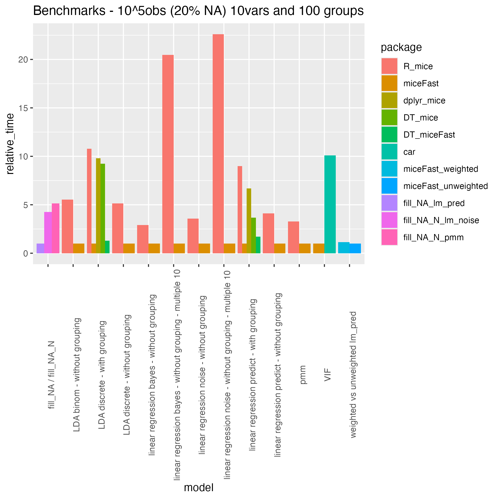

# miceFast <a href='https://github.com/polkas/miceFast'></a>

**Author**: Maciej Nasinski  

[**Check the miceFast website for more details**](https://polkas.github.io/miceFast/index.html)

[](https://github.com/polkas/miceFast/actions)
[](https://cran.r-project.org/package=miceFast)
[](https://app.codecov.io/gh/Polkas/miceFast)
[](https://cran.r-project.org/package=miceFast)

## Overview

**miceFast** provides fast methods for imputing missing data, leveraging an object-oriented programming paradigm and optimized linear algebra routines.  
The package includes convenient helper functions compatible with **data.table**, **dplyr**, and other popular R packages.

Major speed improvements occur when:  
- Using a **grouping variable**, where the data is automatically sorted by group, significantly reducing computation time.
- Performing **multiple imputations**, by evaluating the underlying quantitative model only once for multiple draws.
- Running **Predictive Mean Matching (PMM)**, thanks to presorting and binary search.

For performance details, see `performance_validity.R` in the `extdata` folder.

**Vignettes:**

- [Introduction and Advanced Usage](https://polkas.github.io/miceFast/articles/miceFast-intro.html)
- [Missing Data Mechanisms and Multiple Imputation](https://polkas.github.io/miceFast/articles/missing-data-and-imputation.html)

## Multiple Imputation Workflow

[mice](https://cran.r-project.org/package=mice) implements the full MI pipeline (impute, analyze, pool). **miceFast** focuses on the computationally expensive part — fitting the imputation models — and is typically **~10× faster** than mice for the imputation step alone (see [benchmarks](#performance-highlights)). Two usage modes:

1. **MI with Rubin's rules** — call `fill_NA()` with a stochastic model (`lm_bayes`, `lm_noise`, or `lda` with a random `ridge`) in a loop to create *m* completed datasets, then `pool()` the fitted models.

2. **Single-dataset averaging** — `fill_NA_N()` returns the mean of *k* draws per missing value. Handy for exploration, but not for Rubin's rules (between-imputation variance is lost).

See the [MI vignette](https://polkas.github.io/miceFast/articles/missing-data-and-imputation.html) for worked examples.

## Installation

You can install **miceFast** from CRAN:
```r
install.packages("miceFast")
```
Or install the development version from GitHub:
```r
# install.packages("devtools")
devtools::install_github("polkas/miceFast")
```

## Quick Example

### dplyr

```r
library(miceFast)
library(dplyr)

set.seed(1234)
data(air_miss)

# Visualize the NA structure
upset_NA(air_miss, 6)

# Model-based single imputation
air_miss %>%
  mutate(Ozone_imp = fill_NA(
    x = ., model = "lm_bayes",
    posit_y = "Ozone", posit_x = c("Solar.R", "Wind", "Temp")
  ))

# Proper MI: impute m times, fit models, pool with Rubin's rules
completed <- lapply(1:5, function(i) {
  air_miss %>%
    mutate(Ozone_imp = fill_NA(
      x = ., model = "lm_bayes",
      posit_y = "Ozone", posit_x = c("Solar.R", "Wind", "Temp")
    ))
})
fits <- lapply(completed, function(d) lm(Ozone_imp ~ Wind + Temp, data = d))
pool(fits)
#> Pooled results from 5 imputed datasets
#> Rubin's rules with Barnard-Rubin df adjustment
#>
#>         term estimate std.error statistic    df   p.value
#>  (Intercept)  -62.771   23.9022    -2.626 46.95 1.162e-02
#>         Wind   -3.087    0.6857    -4.502 37.24 6.420e-05
#>         Temp    1.736    0.2498     6.951 58.54 3.400e-09
```

### data.table

```r
library(miceFast)
library(data.table)

set.seed(1234)
data(air_miss)
setDT(air_miss)

# Single imputation
air_miss[, Ozone_imp := fill_NA(
  x = .SD, model = "lm_bayes",
  posit_y = "Ozone", posit_x = c("Solar.R", "Wind", "Temp")
)]

# Grouped imputation — fits a separate model per group
air_miss[, Solar_R_imp := fill_NA(
  x = .SD, model = "lm_bayes",
  posit_y = "Solar.R", posit_x = c("Wind", "Temp", "Intercept")
), by = .(groups)]
```

### Naive imputation (baseline only)

```r
# Quick baseline — biased, does not account for relationships between variables
naive_fill_NA(air_miss)
```

See the [Introduction vignette](https://polkas.github.io/miceFast/articles/miceFast-intro.html) for weights, the OOP interface, log-transformations, and more.

---

## Key Features

- **Object-Oriented Interface** via `miceFast` objects (Rcpp modules).
- **Convenient Helpers**:  
  - `fill_NA()`: Single imputation (`lda`, `lm_pred`, `lm_bayes`, `lm_noise`).  
  - `fill_NA_N()`: Averaged multiple imputations (mean of N draws) (`pmm`, `lm_bayes`, `lm_noise`).  
  - `pool()`: Pool multiply imputed results using Rubin's rules.  
  - `VIF()`: Variance Inflation Factor calculations.  
  - `naive_fill_NA()`: Automatic naive imputations.  
  - `compare_imp()`: Compare original vs. imputed values.  
  - `upset_NA()`: Visualize NA structure using [UpSetR](https://cran.r-project.org/package=UpSetR).

**Quick Reference Table**:

| Function        | Description                                                                 |
|-----------------|-----------------------------------------------------------------------------|
| `new(miceFast)` | Creates an OOP instance with numerous imputation methods (see the vignette). |
| `fill_NA()`     | Single imputation: `lda`, `lm_pred`, `lm_bayes`, `lm_noise`.                   |
| `fill_NA_N()`   | Averaged multiple imputations (mean of N draws): `pmm`, `lm_bayes`, `lm_noise`. |
| `pool()`        | Pools estimates from *m* imputed datasets using Rubin's rules. Works with any model that has `coef()` and `vcov()`. |
| `VIF()`         | Computes Variance Inflation Factors.                                         |
| `naive_fill_NA()` | Performs automatic, naive imputations.                                     |
| `compare_imp()` | Compares imputations vs. original data.                                      |
| `upset_NA()`    | Visualizes NA structure using an UpSet plot.                                 |

---

## Practical Advice

- **Only need a filled-in dataset for exploration or ML?** A single imputation with `fill_NA()` or averaging draws with `fill_NA_N()` is fast and convenient. For any inferential statement use full MI with `pool()`.
- **Little missing data + MCAR?** Consider using `complete.cases()` — listwise deletion is unbiased under MCAR and may be sufficient when the fraction of incomplete rows is small.
- **For publication**, always run a **sensitivity analysis**: compare MI results against base methods (`complete.cases()`, mean imputation) and across different imputation models (`lm_bayes`, `lm_noise`, `pmm`). Vary the number of imputations. If conclusions change, investigate why. Report the imputation model, *m*, and any assumptions about the missing-data mechanism.
- See the [MI vignette](https://polkas.github.io/miceFast/articles/missing-data-and-imputation.html) for details on MCAR/MAR/MNAR mechanisms and a practical checklist.

---

## Performance Highlights

Median timings on 100k rows, 10 variables, 100 groups (R 4.4.3, macOS M3 Pro, [optimized BLAS/LAPACK](https://cran.r-project.org/bin/macosx/RMacOSX-FAQ.html#Which-BLAS-is-used-and-how-can-it-be-changed_003f)):

Imputation quality (SSE) is comparable to mice across all models.



Full benchmark script: `inst/extdata/performance_validity.R`.
