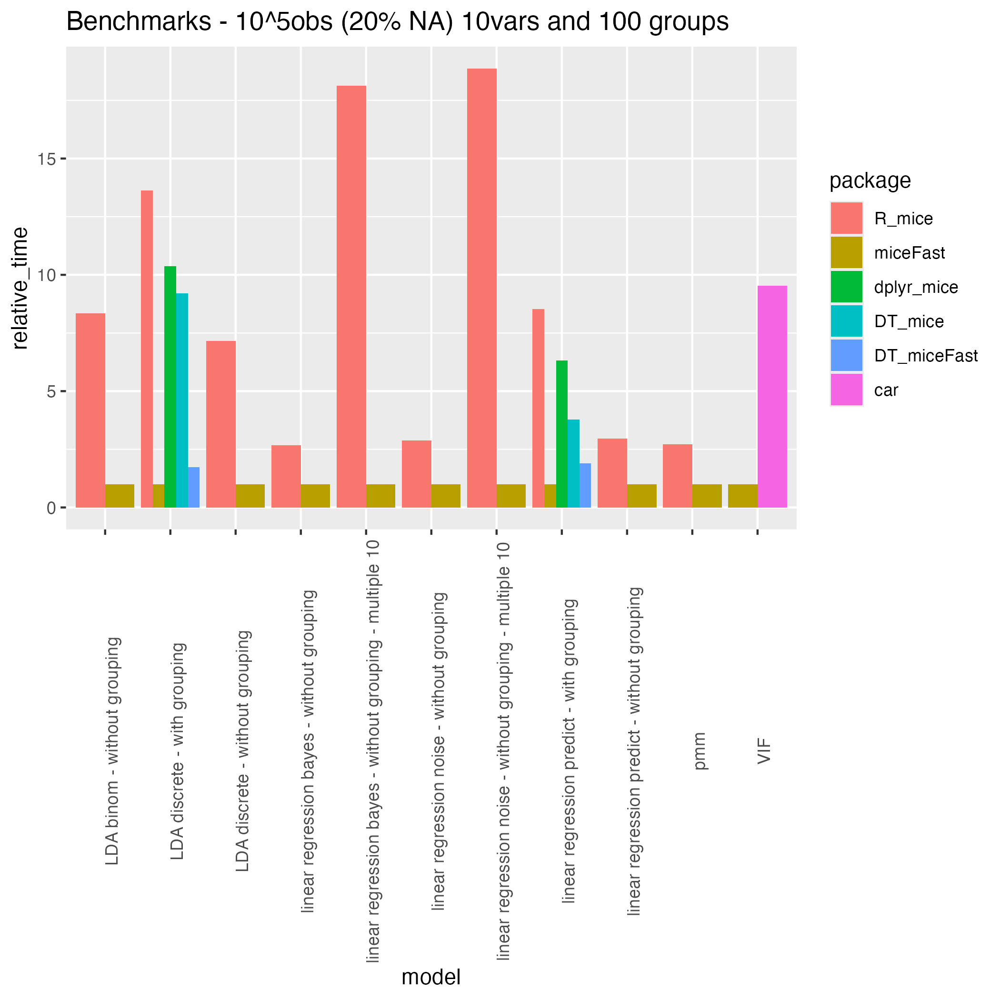

```{r setup, include=FALSE}
knitr::opts_chunk$set(echo = FALSE)
```

Loading the package and setting a seed:

```{r,echo=TRUE,message=FALSE,warning=FALSE}
library(miceFast);library(data.table);library(magrittr)
set.seed(123456)
```

## Description

Fast imputations under the object-oriented programming paradigm.
There was used quantitative models with a closed-form solution. Thus package is based on linear algebra operations.
The biggest improvement in time performance could be achieve for a calculation where a grouping variable have to be used.
A single evaluation of a quantitative model for the multiple imputations is another major enhancement.
Moreover there are offered a few functions built to work with popular R packages.

## Performance

miceFast was compared[^Environment] with the mice package. For grouping option there was used a basic R looping and popular dplyr/data.table packages.
Summing up, miceFast offer a relevant reduction of a calculations time for:  

- Linear Discriminant Analysis around **(x10)**
- where a grouping variable have to be used **(around x50 depending on data dimensions and number of groups and even more than x1000 although compared to data.table only a few times faster or even the same)** because data is sorted by grouping variable
- multiple imputations is faster around **x(a number of multiple imputatition)** because the core of a model is evaluated only ones.

Example:



If you are interested about the procedure of testing performance check performance_validity.R file at the extdata folder.

```{r,eval=FALSE,echo=TRUE}
system.file("extdata","performance_validity.R",package = "miceFast")
```

Additional plots for simulations with certain parameters (but feel free to change them) are located:

```{r,eval=FALSE,echo=TRUE}
system.file("extdata","images",package = "miceFast")
```

Moreover there are offered a few functions built to work with the popular R packages such as 'data.table'.

[^Environment]: Environment: MRO 3.4.4 Intel MKL - i7 6700HQ and 24GB DDR4 2133. MRO (Microsoft R Open) provide to R a sophisticated library for linear algebra operations so remember about that when reading a performance comparison. 

## Motivations

Missing data is a common problem. The easiest solution is to delete observations for which a certain variable is missing. However this will sometimes deteriorate quality of a project. Another solution will be to use methods such as multiple/regular imputations to fill the missing data. Non missing independent variables could be used to approximate a missing observations for a dependent variable. R or Python language are user-friendly for data manipulation but parallely brings slower computations. Languages such as C++ gives an opportunity to boost our applications or projects.

The presented miceFast package was built under Rcpp packages and the C++ library Armadillo.
The Rcpp package offers functionality of exporting full C++ capabilities to the R environment.
More precisely miceFast and corrData are offered. The first module offers capabilities of imputations models with a closed-form solution. Thus package is based on linear algebra operations. The main upgrade is possibility of including a grouping and/or weighting (only for linear models) variable and functions enhancement by C++ capabilities. The second module was made for purpose of presenting the miceFast usage and performance. It provides functionality of generating correlated data with a discrete, binomial or continuous dependent variable and continuous independent variables. 

\newpage

## Introduction for data.table users - using additional functions from miceFast:

Usage of `fill_NA` and `fill_NA_N` functions from miceFast - this functions should be resistant to glitches from an user activity perspective and a data structure.

```r
data = cbind(as.matrix(mice::nhanes),intercept=1,index=1:nrow(mice::nhanes))
data_DT = data.table(data)

# simple mean imputation - intercept at position 5
data_DT[,bmi_imp:=fill_NA(x=as.matrix(.SD),
                         model="lm_bayes",
                         posit_y=2,
                         posit_x=5)] %>% 
# there is a new variable at position 7 - bmi_imp
  .[,hyp_imp:=fill_NA(x=as.matrix(.SD),
                     model="lda",
                     posit_y=3,
                     posit_x=c(1,7)),] %>% 
  .[,chl_imp:=fill_NA_N(x=as.matrix(.SD),
                       model="lm_noise",
                       posit_y=4,
                       posit_x=c(1,7,8),
                       times=10),]

head(data_DT,2)
```

**Model with additional parameters:** - data with the grouping/weighting variable

```r
data = cbind(as.matrix(airquality[,-5]),intercept=1,index=1:nrow(airquality),
             # a numeric vector - positive values 
             weights = round(rgamma(nrow(airquality),3,3),1),
             # as.numeric is needed only for miceFast - see on next pages
             groups = airquality[,5])
data_DT = data.table(data)

# simple mean imputation - intercept at position 6
data_DT[,Ozone_imp:=fill_NA(x=as.matrix(.SD), 
                           model="lm_pred",
                           posit_y=1,
                           posit_x=c(6),w=.SD[['weights']]),by=.(groups)] %>% 
# avg of 10 multiple imputations - last posit_x equal to 9 not 10 
# because the groups variable is not included in .SD
  .[,Solar_R_imp:=fill_NA_N(as.matrix(.SD),
                           model="lm_bayes",
                           posit_y=2,
                           posit_x=c(3,4,5,6,9),w=.SD[['weights']],times=10),by=.(groups)]

data_DT[which(is.na(data_DT[,1]))[1],]
```


\newpage

## Genereting data with the corrData Module

Available constructors:

`new(corrData,nr_cat,n_obs,means,cor_matrix)`

`new(corrData,n_obs,means,cor_matrix)`

where:

- `nr_cat` : number of categories for discrete dependent variable
- `n_obs` : number of observations
- `means`: center independent variables
- `cor_mat` : positive defined correlation matrix

relevant class methods:

- `fill("type")` : generating data [return a numeric matrix] - data with correlated variables where first variable is of binomial,discrete or continuous type.

`type`:character - possible options ("contin","binom","discrete")

## Imputing data with the miceFast Module:

Available constructors:

`new(miceFast)`

relevant class methods:

- `set_data(x)` - providing the data by a reference - a numeric matrix [void]
- `get_data()` - retrieving the data [return a numeric matrix] - the same values as provided by reference x, recommended to use x directly
- `set_g(g)` - providing the grouping variable by a reference - a numeric vector - positive values [void]
- `get_g()` - retrieving the grouping variable [return a numeric vector] - the same values as provided by reference g, recommended to use g directly
- `set_w(w)` - providing the weighting variable by a reference - a numeric vector - positive values
- `get_w()` - retrieving the weighting variable [return a numeric vector] - the same values as provided by reference w, recommended to use w directly
- `get_index()` - getting the index [return a integer vector] - useful after automatic sorting procedure
- `impute("model",posit_y,posit_x)` - impute data under characteristics form object like a optional grouping or weighting variable [return a list with 3 vectors: a numeric vector "imputations" dependent variable with replaced Na values, a integer vector "index_imputed" positions where data was imputed, a integer vector "index_full" positions which were used to assess the model]
- `impute_N("model2",posit_y,posit_x,times)` - multiple imputations - impute data under characteristics form object like a optional grouping or weighting variable - works for ("lm_bayes","lm_noise") - [return a list with 3 vectors: a numeric vector "imputations" dependent variable with replaced Na values by average of N results, a integer vector "index_imputed" positions where data was imputed, a integer vector "index_full" positions which were used to assess the model]
- `update_var(posit_y,imputations)` - permanently update variable at the object and data. WARNING, use it only if you are sure about model parameters. [void]
- `get_models()` - possible quantitative models for a certain type of dependent variable [return a character vector: recommended models for impute and impute_N methods] 
- `get_model()` - a recommended quantitative model for a certain type of dependent variable [return a character: recommended model for impute and impute_N methods] - useful while looping
- `which_updated()` - which variables were modified by update_var at the object (and data) [return a integer vector: positions at provided data at which variables were update by update_var method] 
- `sort_byg()` - sort data by the grouping variable [void]
- `is_sorted_byg()` - is data sorted by the grouping variable [void]
- `vifs(posit_y,posit_x)` - Variance inflation factors (VIF) [return a numeric vector: VIF for all variables provided by posit_x]
`x` : numeric matrix - variables  
`g` : numeric vector - you could build it form several discrete variables  
`w`:  numeric vector with positive values - weights for weighted linear regressions  
`model`: character - a possible options ("lda","lm_pred","lm_bayes","lm_noise")  
`posit_y`: integer - a position of dependent variable  
`posit_x`: integer vector - positions of independent variables  
`imputations` : numeric vector - imputations  
`times` : integer - number of multiple imputations 

*For a simple mean imputations add intercept to data and use "lm_pred"*  
*The lda model is assessed only if there are more than 15 complete observations and for the lms models if the number of independent variables is smaller than the number of observations.*

\newpage

###Imputations

**miceFast module usage:**

Remember that a matrix could be build only under a one data type so factor variables have to be melted
use `model.matrix` to get numeric matrix from `data.frame` - see Tips in this document

```{r,echo=TRUE}
#install.packages("mice")
data = cbind(as.matrix(mice::nhanes),intercept=1,index=1:nrow(mice::nhanes))
model = new(miceFast)
model$set_data(data) #providing data by a reference

model$update_var(2,model$impute("lm_pred",2,5)$imputations)
#OR not recommended
#data[,2] = model$impute("lm_pred",2,5)$imputations
#model$set_data(data) #Updating the object

model$update_var(3,model$impute("lda",3,c(1,2))$imputations) 

#Old slow syntax model$update_var(4,rowMeans(sapply(1:10,function(x) model$impute("lm_bayes",4,c(1,2,3))$imputations)))
#New syntax - impute_N
model$update_var(4,model$impute_N("lm_bayes",4,c(1,2,3),10)$imputations)

#When working with 'Big Data'
#it is recommended to occasionally manually invoke a garbage collector `gc()`

# Be careful with `update_var` because of the permanent update at the object and data
# That is why `update_var` could be used only ones for a certain column
# check which variables was updated - inside the object
model$which_updated()
head(model$get_data(),3)
head(data,3)
head(mice::nhanes,3)
rm(model)
```

\newpage

**Model with additional parameters:** - data sorted by the grouping variable

```{r,echo=TRUE}
data = cbind(as.matrix(airquality[,-5]),intercept=1,index=1:nrow(airquality))
weights = rgamma(nrow(data),3,3) # a numeric vector - positive values
groups = as.numeric(airquality[,5]) # a numeric vector not integers - positive values - sorted increasingly

model = new(miceFast)
model$set_data(data) # providing data by a reference
model$set_w(weights) # providing by a reference
model$set_g(groups)  # providing by a reference

#impute adapt to provided parmaters like w or g
#Simple mean - permanent imputation at the object and data
model$update_var(1,model$impute("lm_pred",1,c(6))$imputations)

model$update_var(2,model$impute_N("lm_bayes",2,c(1,3,4,5,6),10)$imputations)

#Printing data and retrieving an old order
head(cbind(model$get_data(),model$get_g(),model$get_w())[order(model$get_index()),],4)

head(airquality,3)

head(cbind(model$get_data(),model$get_g(),model$get_w()),3)

head(cbind(data,groups,weights),3)

rm(model)

```

\newpage

**Model with additional parameters:** - data not sorted by the grouping variable

```{r,echo=TRUE}
data = cbind(as.matrix(airquality[,-5]),intercept = 1,index = 1:nrow(airquality))
weights = rgamma(nrow(data),3,3) # a numeric vector - positive values
#groups = as.numeric(airquality[,5]) # a numeric vector not integers - positive values
groups = as.numeric(sample(1:8,nrow(data),replace=T)) # a numeric vector not integers - positive values

model = new(miceFast)
model$set_data(data) # providing by a reference
model$set_w(weights) # providing by a reference
model$set_g(groups)  # providing by a reference
#impute adapt to provided parmaters like w or g
#Warning - if data is not sorted increasingly by the g then it would be done automatically 
#during a first imputation
#Simple mean - permanent imputation at the object and data
model$update_var(1,model$impute("lm_pred",1,6)$imputations)

model$update_var(2,model$impute_N("lm_bayes",2,c(1,3,4,5,6),10)$imputations)

#Printing data and retrieving an old order
head(cbind(model$get_data(),model$get_g(),model$get_w())[order(model$get_index()),],4)

head(airquality,4)

head(cbind(model$get_data(),model$get_g(),model$get_w()),4) #is ordered by g

head(cbind(data,groups,weights),4) #is sorted by g cause we provide data by a reference

rm(model)

```

\newpage

### Tips

**matrix from data.frame**

Remember that a matrix could be build only under a one data type so factor/character variables have to be melted.
Sb could use `model.matrix` to get numeric matrix from a `data.frame`:

```{r,echo=TRUE}
#str(mtcars)
mtcars$cyl= factor(mtcars$cyl)
mtcars$gear= factor(mtcars$gear)
mtcars_mat = model.matrix.lm(~.,mtcars,na.action="na.pass")
#str(mtcars_mat)
```

**Variance inflation factors (VIF)**

VIF measure how much the variance of the estimated regression coefficients are inflated. It helps to identify when the predictor variables are linearly related. You have to decide which variable should be delete. Values higher than 10 signal a potential collinearity problem.

```{r,echo=TRUE}
airquality2 = airquality
airquality2$Temp2 = airquality2$Temp**2
#install.packages("car")
#car::vif(lm(Ozone ~ ., data=airquality2))

airquality2_mat = as.matrix(airquality2)
model = new(miceFast)
model$set_data(airquality2_mat)
as.vector(model$vifs(1,c(2,3,4,5,6,7)))

data_DT = data.table(airquality2)
# VIF for variables at 1,3,4 positions - you include a y position to consider its NA values
as.vector(data_DT[,.(vifs=VIF(x=as.matrix(.SD),
                posit_y=1,
                posit_x=c(2,3,4,5,6,7)))][['vifs']])
```

##Bibliography

URL: http://dirk.eddelbuettel.com/code/rcpp/Rcpp-modules.pdf  
Title: Exposing C++ functions and classes with Rcpp modules Dirk Eddelbuettel and Romain François  
Author: http://dirk.eddelbuettel.com and  https://romain.rbind.io/   
Date: March 8, 2018

URL: http://dirk.eddelbuettel.com/papers/RcppArmadillo-intro.pdf  
Title: RcppArmadillo: Easily Extending R with High-Performance C++ Code  
Author: Dirk Eddelbuettel and Conrad Sanderson  
Date: July 1, 2012

URL: http://www.stefvanbuuren.nl/publications/MICE%20in%20R%20-%20Draft.pdf  
Title: MICE: Multivariate Imputation by Chained Equations in R  
Author: Stef van Buuren  
Date: 2013

URL: http://dirk.eddelbuettel.com/code/rcpp/Rcpp-introduction.pdf  
Title: Extending R with C++: A Brief Introduction to Rcpp   
Author: Dirk Eddelbuettel and James Joseph Balamuta  
Date: March 8, 2018  

URL: http://courses.cs.tamu.edu/rgutier/csce666_f13/  
Title: CSCE 666: Pattern Analysis  
Author: Ricardo Gutierrez-Osuna  
Date: Fall 2013
